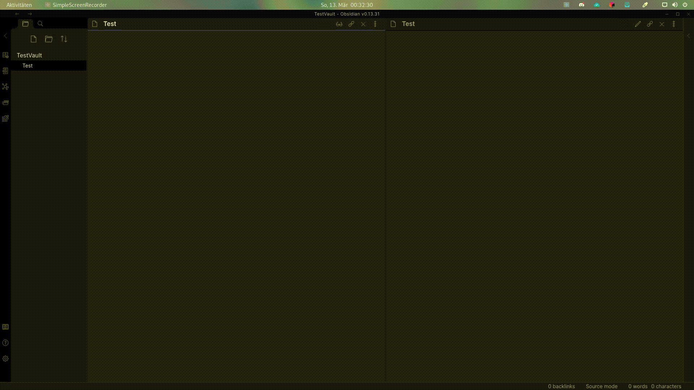

# Obsidian-matrix
## Obsidian-matrix allows you to quickly and easily create LaTeX matrices
### Usage
Simple video showing off Obsidian-matrix:

### Installation
Because this plugin isn't available from the community plugins yet,
you have to install it manually:
- Click the download zip button (in code submenu)
- Copy the extracted folder to <YourVault>/.obsidian/plugins/
